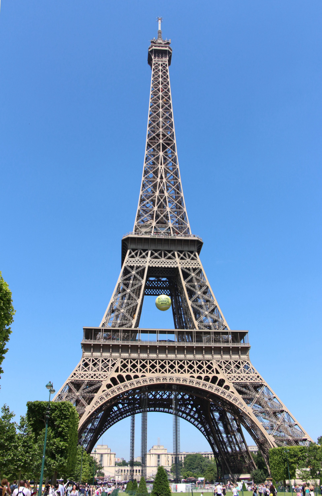
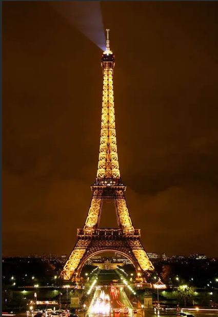
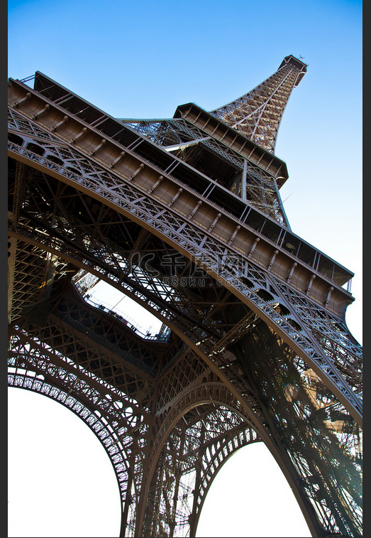
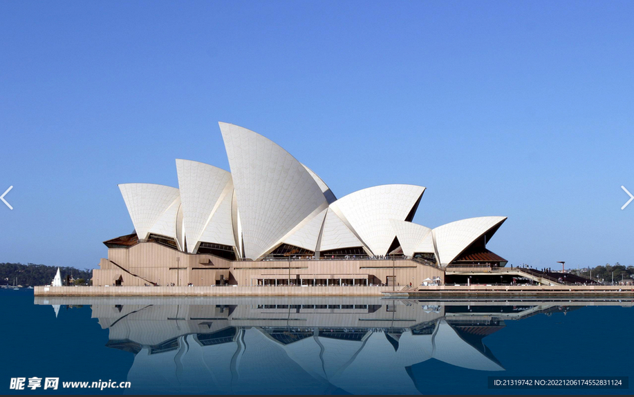
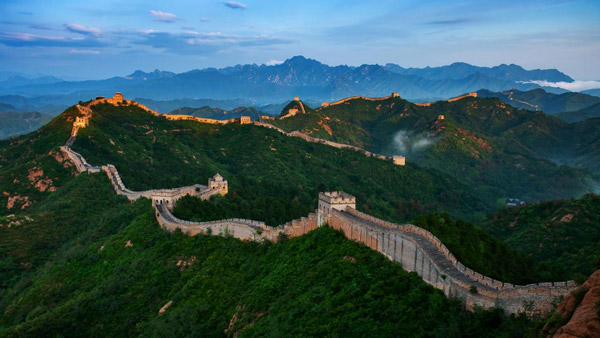
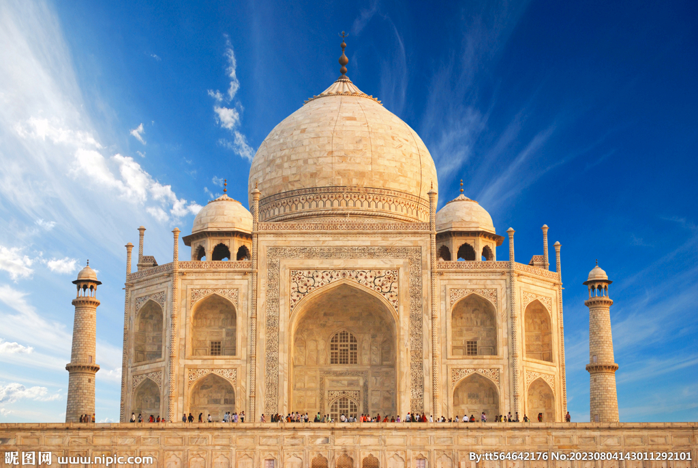
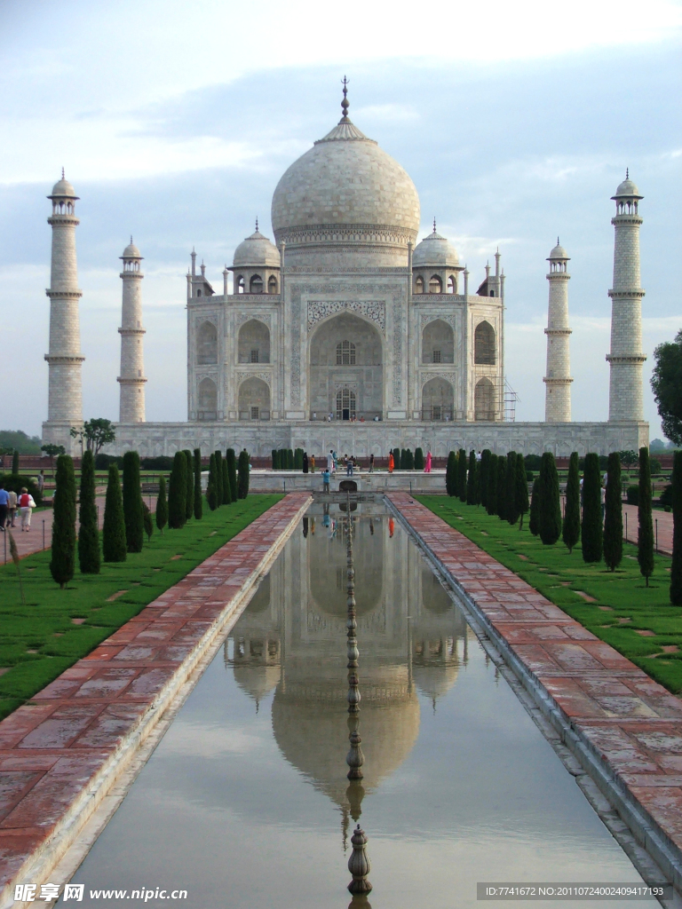
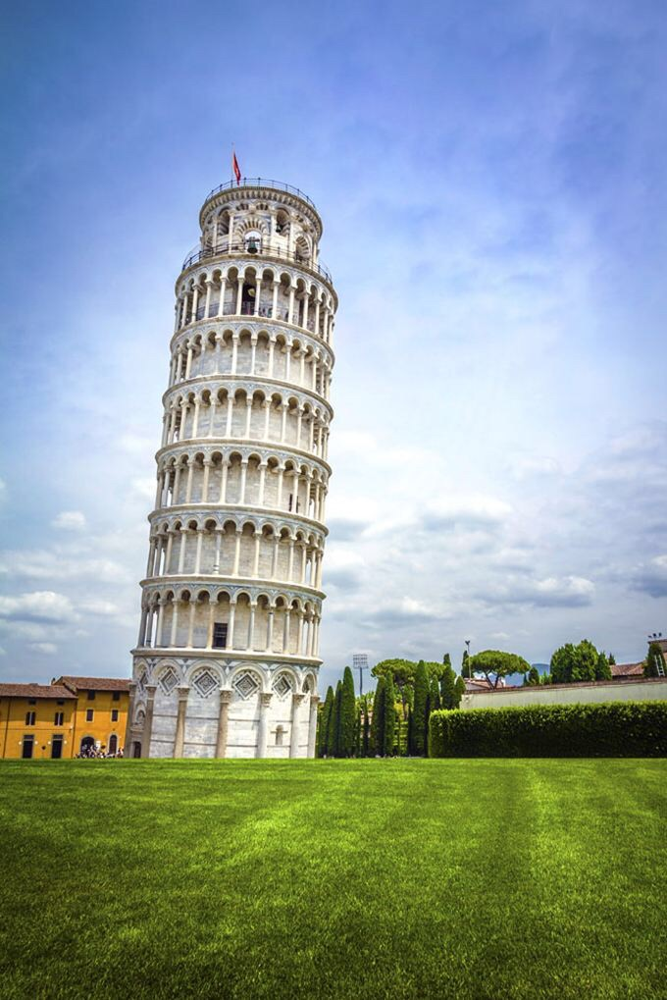
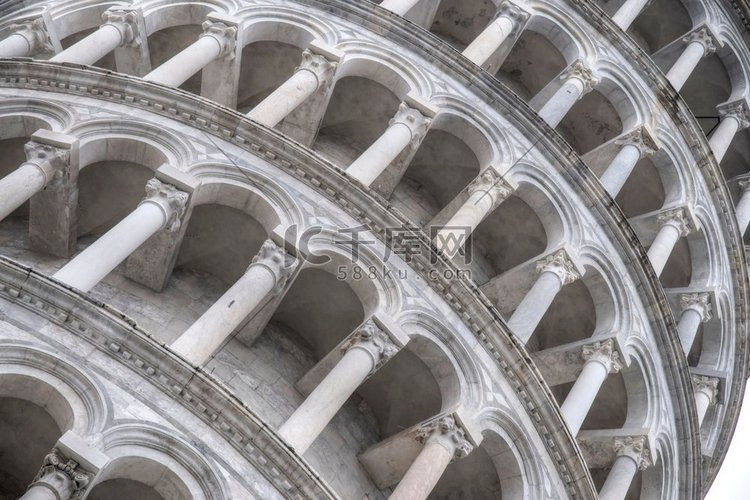

# 多模态测试语料：世界著名建筑

## 埃菲尔铁塔

**基本信息**：
- 位置：法国巴黎
- 高度：324米
- 建造时间：1889年
- 设计师：古斯塔夫·埃菲尔

**建筑特点**：
埃菲尔铁塔是一座工程与美学融合的里程碑式建筑，其镂空铁架结构由超过18,000个锻铁构件和250万个铆钉组成，总重量达7,300吨。这种开放结构不仅大幅减轻了自重，还有效降低了风阻，使其在强风中仍能保持稳定——这一设计在当时是革命性的。铁塔的曲线轮廓并非纯粹装饰，而是经过精确的空气动力学计算，以最小化风压影响。三层观景平台分别位于57米、115米和276米处，为游客提供渐进式的城市全景体验。夜间，铁塔被20,000个高压钠灯和2,000个LED灯点亮，每小时上演5分钟的“闪烁灯光秀”，这一动态照明系统由法国电信与建筑师合作开发，成为全球首个以建筑为媒介的夜间艺术表演。其结构逻辑深刻影响了现代高层金属结构的设计范式。

**相关图片**：

*白天的埃菲尔铁塔全景，可以看到其标志性的镂空铁架结构*

*夜晚的埃菲尔铁塔，灯光璀璨*

*铁塔底部的铁架结构细节*

---

## 悉尼歌剧院

**基本信息**：
- 位置：澳大利亚悉尼
- 建成时间：1973年
- 设计师：约恩·乌松
- 建筑风格：表现主义

**建筑特点**：
悉尼歌剧院是20世纪最具表现力的建筑之一，其标志性的“壳体”并非几何规则的球面，而是由1,056块预制混凝土肋骨支撑的薄壳结构，每块壳体由数百万块瑞典产的白色瓷砖覆盖，形成统一而富有韵律的表面。这些壳体的几何形态源于对球体的切割与重组，由设计师约恩·乌松在纸面推演中偶然发现，后经工程师团队用计算机建模（当时最先进的技术）实现。整个建筑群由四个主要“壳群”构成，内部容纳音乐厅、歌剧厅、戏剧厅等多个功能空间，声学设计由世界级专家团队完成，确保每个座位均获得卓越音质。其临海而立的位置使其成为“建筑与自然对话”的典范——白天，白色壳体在阳光下如扬帆的船队；黄昏时，建筑轮廓与海港大桥共同构成城市天际线的灵魂。2007年被联合国教科文组织列为世界遗产，评价其为“现代建筑史上最具创意的杰作之一”。

**相关图片**：

*歌剧院正面，展示标志性的帆船造型*

*从海港看歌剧院，背景是悉尼港大桥*

---

## 长城

**基本信息**：
- 位置：中国北部
- 总长度：约21,000公里
- 建造时期：公元前7世纪至明朝
- 主要功能：军事防御

**建筑特点**：
长城并非单一连续墙体，而是由战国至明代历经千年修建、分段连接的庞大防御体系，其构造因地制宜，北方段以夯土与石块为主，山地段则采用青砖包砌，内部填充碎石与黄土，形成坚固的复合结构。墙体平均高7–8米，顶宽4–5米，可容五马并驰，设有垛口、射孔、瞭望台与排水系统。烽火台每隔5公里设置，通过烟火信号实现信息快速传递，形成古代“军事互联网”。关隘如山海关、居庸关、嘉峪关等，兼具军事指挥、物资运输与边贸管理功能，是多民族交流的枢纽。八达岭与慕田峪段保存最完整，其砖石工艺精细，灰浆采用糯米浆与石灰混合，强度远超普通水泥。长城的修建动用数百万劳工，其规模、持续时间与工程智慧，使其成为人类历史上最宏大的非自然人造结构，也是地表唯一从太空肉眼可见的人造物（虽为误传，但象征意义深远）。

**相关图片**：

*长城蜿蜒在山岭之间的壮观景象*

*长城的烽火台*

---

## 泰姬陵

**基本信息**：

- 位置：印度阿格拉
- 建成时间：1653年
- 建筑风格：莫卧儿建筑
- 材料：白色大理石

**建筑特点**：
泰姬陵是莫卧儿帝国建筑艺术的巅峰之作，以纯白色卡拉拉大理石为主体，镶嵌超过28种半宝石（包括绿松石、玛瑙、青金石、玉髓），通过“皮埃特拉·杜拉”（Pietra Dura）镶嵌工艺，形成繁复的花卉与几何纹饰，纹样精确到毫米级，历时22年完成。建筑群呈完美的轴对称布局，中央穹顶高达35米，为双层结构，外层为大理石外壳，内层为支撑结构，有效减轻重量并增强声学效果。四座宣礼塔各高40米，略微向外倾斜，以防地震时倒塌压毁主陵。整座陵墓坐落在一个巨大的矩形花园（查尔巴格）中央，四条水道象征伊斯兰教中的天堂之河，倒影使建筑在视觉上呈现出“双重存在”的诗意。大理石在不同光线与天气下呈现粉红、金黄、乳白甚至银灰的微妙变化，尤其在月光下，被誉为“凝固的诗篇”。其设计融合了波斯、伊斯兰、印度与中亚建筑传统，是跨文化融合的典范，也被联合国教科文组织誉为“爱情的永恒象征”。

**相关图片**：

*泰姬陵正面，展示完美的对称结构*

*泰姬陵倒映在前方水池中*

---

## 比萨斜塔

**基本信息**：
- 位置：意大利比萨
- 高度：56米
- 建造时期：1173-1372年
- 倾斜角度：约3.97度

**建筑特点**：
比萨斜塔原为比萨大教堂的独立钟楼，始建于1173年，因地基位于软弱的冲积土层上，且未设足够基础，从第三层施工起即出现明显倾斜。其圆柱形结构由白色大理石砌成，共八层，外立面装饰有拱廊与科林斯柱式，体现典型的罗马式风格。塔身总重约14,500吨，倾斜角度在19世纪末曾达5.5度，一度面临倒塌风险。20世纪末，国际工程团队实施“土壤抽取法”——通过在北侧地基下缓慢移除土壤，使塔身逐步回正约0.5度，最终稳定在3.97度，并确保未来至少300年安全。塔内设有294级螺旋石阶，攀登时可明显感受到倾斜带来的失重感。其倾斜并非缺陷，反而成为工程学、地质学与建筑修复的全球研究样本，被誉为“最美的错误”。如今，它不仅是意大利的象征，更成为“非完美之美”的哲学隐喻，启发了无数关于稳定、平衡与适应性的跨学科讨论。

**相关图片**：

*比萨斜塔全景，可以清楚看到倾斜的角度*

*塔身的大理石雕刻细节*

