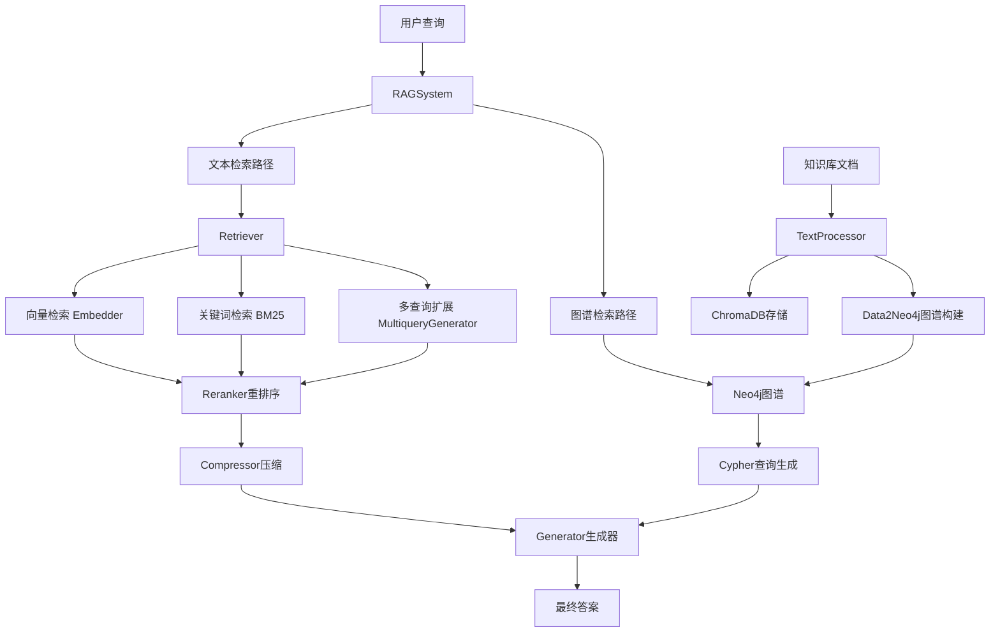

# RAG_demo - 双引擎智能问答系统 🚀

[](https://www.python.org/downloads/)
[](LICENSE)
[](https://arxiv.org/abs/2005.11401)
[](https://neo4j.com/)

一个基于检索增强生成（RAG）技术的双引擎智能问答系统，融合**文本检索**和**知识图谱**两种数据源，支持多种文档格式、多种检索策略和多语言处理。

## 🌟 主要特性

### 🔍 双引擎检索架构
- **文本检索引擎**: 向量检索 (语义相似度)、关键词检索 (BM25)、混合检索 (RRF融合)、多查询扩展
- **知识图谱引擎**: 基于Neo4j的实体关系图谱，支持复杂语义推理和Cypher查询
- **智能融合**: 自动选择最优检索策略，提供更精准的答案

### 📚 格式与语言支持
- **文档格式**: Markdown (.md)、Word文档 (.docx)、纯文本 (.txt)
- **多语言支持**: 中文 (jieba分词)、英文智能分词和检索优化
- **自动构图**: 从文档自动抽取实体关系，构建知识图谱

### 🚀 高级功能
- **🎯 智能重排序**: 基于 Cross-Encoder 的多语言结果重排序
- **💡 上下文压缩**: 抽取式压缩，减少 token 消耗，提升生成质量
- **🧠 实体消歧**: LLM驱动的实体识别与合并，保证图谱质量
- **⚡ 持久化存储**: ChromaDB + Neo4j + 增量更新，避免重复处理
- **🏗️ 模块化架构**: 依赖注入设计，易于扩展和测试

## 🔧 项目结构

```
RAG_demo/
├── Knowledgebase/              # 📚 知识库文档存放目录
│   ├── Alan Turing.md         # 示例：图灵传记
│   ├── biology_knowledge.md   # 示例：生物学知识
│   ├── fictional_knowledge.md # 示例：科幻内容
│   └── ...
├── rag_system/                 # 🔧 核心系统模块
│   ├── config.py              # ⚙️ 配置管理
│   ├── rag_system.py          # 🎯 主系统入口
│   ├── retriever.py           # 🔍 文本检索器
│   ├── reranker.py            # 📊 结果重排序
│   ├── compressor.py          # 🗜️ 上下文压缩器
│   ├── generator.py           # 🤖 答案生成器
│   ├── embedder.py            # 🧠 向量嵌入器
│   ├── multiquery_generator.py # 🔄 多查询生成器
│   ├── database.py            # 💾 数据库管理
│   ├── text_utils.py          # 📝 文本处理工具
│   ├── smart_tokenize.py      # ✂️ 智能分词器
│   └── neo/                   # 🕸️ 知识图谱模块
│       ├── Data2Neo4j.py        # 向后兼容适配器
│       ├── knowledge_graph_builder.py  # 主协调器
│       ├── graph_database.py    # Neo4j数据库操作
│       ├── entity_extractor.py  # 实体抽取器
│       ├── graph_processor.py   # 图谱处理器
│       ├── query_engine.py      # 图谱查询引擎
│       ├── entity_merger.py     # 实体合并器
│       └── data_structure.py    # 数据结构定义
├── main.py                     # 🚀 示例程序
├── requirements.txt            # 📦 依赖列表
└── README.md                   # 📜 项目文档
```

## 🏗️ 系统架构



### 设计模式亮点

#### 依赖注入模式
**问题**: 在重构过程中遇到的依赖纠缠问题，解决方案：依赖倒置 + 抽象接口

```python
# 1. 定义抽象接口
class QueryExpander:
    def expand(self, query: str, num_queries: int) -> List[str]:
        raise NotImplementedError

# 2. 具体实现
class MultiqueryGenerator(QueryExpander):
    def expand(self, query, num_queries=3):
        # LLM 生成多查询逻辑
        return queries

# 3. 依赖注入
self.retriever = Retriever(db, embedder, query_expander=query_expander)
```

#### 策略模式
- **QueryExpander** 作为策略接口
- **MultiqueryGenerator** 作为具体策略实现
- 可轻易添加其他查询扩展策略（如基于规则的扩展、词汇扩展等）

## 🚀 完整部署指南

> ⚠️ **重要提示**: 本系统依赖Neo4j数据库存储知识图谱，必须先安装和配置Neo4j

### 步骤1: 系统要求检查

- **Python 3.8+** (检查: `python --version`)
- **内存**: 至少4GB RAM (推荐8GB+)
- **硬盘空间**: 至少2GB 可用空间
- **网络**: 稳定的互联网连接 (调用 Gemini API)

### 步骤2: Neo4j数据库安装 🔧

#### 选项A: Neo4j Desktop (🔥 推荐新手)

1. **下载安装**
   ```bash
   # 访问官网下载并安装
   https://neo4j.com/download/
   ```

2. **创建数据库**
   - 打开 Neo4j Desktop
   - 点击 "**New**" -> "**Create Database**"
   - 设置数据库名称: `rag-knowledge-graph`
   - 设置用户名称：`neo4j`
   - **设置密码**: `neo4j`(第一次登录时的默认密码) 
   - 点击 "**Create**"
   
3. **启动服务**
   - 选中刚创建的数据库
   - 点击 "**Start**" 按钮
   - 等待状态变为 "**Running**" (通常需要30-60秒)

4. **验证安装**
   ```bash
   # 访问 Web 界面
   http://localhost:7474
   
   # 登录信息
   URI: bolt://localhost:7687
   Username: neo4j
   Password: 123456qq
   ```

#### 选项B: Docker部署 (🚀 推荐开发者)

```bash
# 1. 下载并运行Neo4j容器
docker run \
    --name rag-neo4j \
    -p 7474:7474 -p 7687:7687 \
    -d \
    -v rag_neo4j_data:/data \
    -v rag_neo4j_logs:/logs \
    --env NEO4J_AUTH=neo4j/123456qq \
    --env NEO4J_PLUGINS='["apoc"]' \
    neo4j:5.15

# 2. 检查容器状态
docker ps | grep rag-neo4j

# 3. 查看日志 (确保正常启动)
docker logs rag-neo4j | tail -20

# 4. 验证访问
echo "访问 http://localhost:7474 进行验证"
```

### 步骤3: 项目环境配置

### 使用示例（main.py）

```python
from rag_system.config import RAGConfig
from rag_system.rag_system import RAGSystem

# 1. 创建配置
config = RAGConfig(
    embedding_model_name="gemini-embedding-001",
    llm_model_name="deepseek-chat",
    verbose=True
)

# 2. 初始化 RAG 系统
rag = RAGSystem(config)

# 3. 添加知识库文档
rag.add_corpus("biology_knowledge.md", language="English")
rag.add_corpus("中文文档.md", language="Chinese")

# 4. 执行查询
answer = rag.query(
    query="图灵被定成什么罪了？",
    mode="hybrid",       # 检索模式: vector/keyword/text_hybrid/expand/graph/hybrid
    compress=True       # 是否启用上下文压缩
)
print(answer)
```

## 📚 知识库管理

### 添加文档
```python
# 添加 Markdown 文件 (英文)
rag.add_corpus("advanced_retrieval.md", language="English")

# 添加 Word 文档 (中文)
rag.add_corpus("技术规范.docx", language="Chinese")

# 系统会自动检查重复，只添加新的文档块
```

### 更新文档
```python
# 更新已存在的文档 (先删除再添加)
rag.update_corpus("biology_knowledge.md", language="English")
```

### 删除文档
```python
# 从知识库中删除指定文档
rag.remove_corpus("obsolete_document.md")
```

## 🗺️ 语言支持

### 中文处理
- 使用 `jieba` 分词库进行中文分词
- 支持 `zh_core_web_sm` spaCy 模型
- 优化的中文 BM25 检索

### 英文处理
- 使用 `en_core_web_sm` spaCy 模型
- 标准英文分词和处理

### 语言设置
```python
# 添加中文文档
rag.add_corpus("中文技术文档.md", language="Chinese")

# 添加英文文档
rag.add_corpus("english_document.md", language="English")
```

## ⚡ 性能优化

### 1. 增量更新
系统自动检测已存在的文档块，避免重复处理：
```python
# 只会添加新增的文档块
rag.add_corpus("updated_document.md")
```

### 2. 上下文压缩
减少 token 消耗，提升响应速度：
```python
answer = rag.query("问题", compress=True)
```

### 3. 检索策略性能对比
根据实际测试，不同检索策略的表现：

**测试查询**: "What is the BM25 formula?"

| 检索模式 | 精确性 | 召回率 | 适用场景 |
|------------|----------|----------|------------|
| **keyword** | 高 | 中等 | 精确术语匹配 |
| **vector** | 高 | 高 | 语义理解 |
| **text_hybrid** | 高 | 最高 | 综合性能 |
| **expand** | ⚡最高 | 最高 | 复杂查询 |
| **hybrid** | 🏆最优 | 最高 | 全面覆盖 |

**关键发现**:
- **BM25** 对专业术语能直接命中最相关文档
- **向量检索** 在语义理解上表现更佳，能找到更多相关内容
- **混合模式** 结合两者优势，效果最均衡

## 🔬 技术栈

- **深度学习框架**: PyTorch
- **向量数据库**: ChromaDB 1.0.20
- **搜索引擎**: BM25Okapi (rank-bm25)
- **文本处理**: LangChain, spaCy
- **嵌入模型**: Google Gemini API
- **生成模型**: DeepSeek API
- **重排序**: Cross-Encoder 模型 (BAAI/bge-reranker-base)
- **知识图谱**: Neo4j

### 检索模式详解

| 模式 | 描述 | 技术原理 | 适用场景 |
|------|------|----------|----------|
| `vector` | 纯向量检索 | 语义相似度算法 | 概念性问题，语义相似性搜索 |
| `keyword` | 纯关键词检索 | BM25 算法，精确匹配 | 专业术语、罕见关键词查找 |
| `text_hybrid` | 混合检索 | RRF 融合向量+关键词 | 平衡语义和关键词，日常使用 |
| `expand` | 查询扩展检索 | LLM 查询扩展 + 多轮检索 | 最佳召回率和准确性 |
| `graph` | 纯图谱检索 | Neo4j Cypher 查询 | 关系型问题，精确关系推理 |
| `hybrid` | **混合检索(推荐)** | 文本+图谱双引擎融合 | 最全面覆盖，默认模式 |

#### 检索模式细节
**关键词检索优势**:

- 对于包含 **精确、罕见术语** 的查询，能快速精确定位
- 示例: 查询 "BM25 formula" 时，BM25 直接命中相关文档

**向量检索优势**:

- 理解语义关联，适合概念性和抽象问题
- 能够找到语义相似但关键词不同的文档

**Expand 模式原理**:
1. LLM 生成多个语义相关查询
2. 对每个查询执行混合检索
3. 使用 RRF 算法融合所有结果

### 检索模式示例
```python
# 向量检索 - 语义搜索
answer = rag.query("什么是人工智能？", mode="vector")

# 关键词检索 - 精确匹配
answer = rag.query("BM25 algorithm", mode="keyword")

# 混合检索 - 综合考虑
answer = rag.query("深度学习的应用", mode="text_hybrid")

# 查询扩展 - 最佳效果
answer = rag.query("机器学习算法比较", mode="expand")

# 知识图谱检索 - 精确关系推理
answer = rag.query("图灵都研究啥的？", mode="graph")

# 双引擎融合 - 最全面覆盖(推荐)
answer = rag.query("人工智能的发展历史和未来趋势", mode="hybrid")
```

## 🛠️ 高级功能

### 上下文压缩
```python
# 启用上下文压缩，减少token消耗
answer = rag.query("你的问题", compress=True)
```

### 文档过滤
```python
# 只在特定文档中搜索
answer = rag.query("你的问题", source_filter="specific_doc.md")
```

### 结果数量控制
```python
# 控制检索和重排序的结果数量
answer = rag.query("你的问题", k=20, top_n=8)
```

## 👾 支持的文件格式

- **Markdown** (`.md`) - 技术文档、知识库
- **Word文档** (`.docx`) - 正式文档、报告
- **纯文本** (`.txt`) - 简单文本文件

## 🐛 常见问题排查

### Q1: 报错 "请先设置 GOOGLE_API_KEY 环境变量"
**解决方案**: 设置环境变量
```bash
# Windows
$env:GOOGLE_API_KEY="your_api_key_here"

# Linux/Mac
export GOOGLE_API_KEY="your_api_key_here"
```

### Q2: 报错 "请先设置 DEEPSEEK_API_KEY 环境变量"
**解决方案**: 设置 DeepSeek API 密钥
```bash
# Windows
$env:DEEPSEEK_API_KEY="your_deepseek_api_key_here"

# Linux/Mac
export DEEPSEEK_API_KEY="your_deepseek_api_key_here"
```

### Q3: Neo4j 连接问题
**问题描述**: 报错 "Neo4j初始化出错"
**解决方案**: 
```bash
# 1. 检查Neo4j服务状态
# Neo4j Desktop: 确保显示"Running"
# Docker: docker ps | grep neo4j

# 2. 检查端口
netstat -an | findstr 7687  # Windows
netstat -an | grep 7687     # Linux/Mac

# 3. 测试连接
# 访问 http://localhost:7474 并登录
```

### Q4: spaCy 模型下载失败
**解决方案**: 手动下载语言模型
```bash
python -m spacy download en_core_web_sm
python -m spacy download zh_core_web_sm

# 如果网络问题，可使用镜像源
pip install -i https://pypi.tuna.tsinghua.edu.cn/simple/ spacy
```

### Q5: APOC插件问题
**问题描述**: 看到"apoc.refactor.mergeNodes not found"
**解决方案**: 
- 不用担心，系统会自动跳过实体合并功能
- 如需安装: Neo4j Desktop -> Plugins -> APOC -> Install
- Docker部署时已自动包含APOC插件

### Q6: 如何提高检索准确性？
**廊议**:
- 使用 `hybrid` 模式（默认）
- 结合 `compress=True` 参数
- 适当调整 `k` 和 `top_n` 参数
- 确保文档语言设置正确

### Q7: 数据库文件存储在哪里？
**答案**: 

- 向量数据库：`./chroma_db/` 目录
- 知识图谱：Neo4j数据库中
- 日志文件：控制台输出

### Q8: 如何删除或更新文档？
```python
rag.remove_corpus("filename.md")    # 删除文档
rag.update_corpus("filename.md")    # 更新文档(先删除再添加)
```

## 🎮 运行示例

直接运行项目自带的示例：

```bash
python main.py
```

示例包含了对图灵的多个问题，展示系统问答能力：
- "图灵在性格上有什么特点？"
- "图灵的身体素质如何？" 
- "图灵都提出过什么，研究过什么？"
- "图灵都有什么头衔啊，身份啊之类的东西？"

### 输出示例

以下是系统对“图灵在性格上有什么特点？”的回答示例：

```
根据提供的文本和图谱数据，我可以总结出图灵在性格上具有以下特点：

1. **古怪特立独行**：
   - 在布莱切利庄园工作时，因行为独特而被同事称为“教授”。
   - 每年花粉过敏季节会戴着防毒面具骑自行车上班
   - 自行车链条经常脱落却不修理，而是计算踏板转动次数后手动调整
   - 将茶杯罰在散热器管上以防被偷

2. **天才特质**：
   - 同事彼得·希尔顿描述与他共事是“遇到真正的天才”，认为图灵的智能“深刻而独创”
   - 展现出非凡的智力和创造力

3. **坚韧执着**：
   - 少年时期为了上学，在大罢工期间独自骑行60英里
   - 在学术上坚持自己的科学兴趣，不顾学校偏重人文的教育倾向

4. **运动天赋**：
   - 是一名长跑运动员，曾在马拉松和越野赛中取得优异成绩
```

这个答案融合了文本检索和知识图谱的信息，提供了全面而准确的回答。

## 📞 技术支持

如果在使用过程中遇到问题，请：
1. 检查API密钥和数据库连接配置
2. 查看控制台输出的详细错误信息
3. 确认文档格式和编码正确

---

**开始您的智能问答之旅！** 🌟