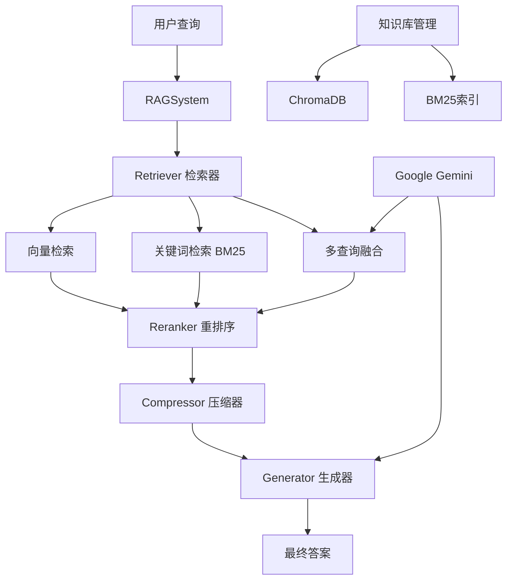

# RAG_demo - 检索增强生成系统

[](https://www.python.org/downloads/)
[](LICENSE)
[](https://arxiv.org/abs/2005.11401)

一个基于检索增强生成（RAG）技术的智能问答系统，支持多种文档格式、多种检索策略和多语言处理。

## 🌟 主要特性

- **🔍 多种检索策略**: 向量检索 (HNSW)、关键词检索 (BM25)、混合检索 (RRF)、多查询融合
- **📚 格式支持**: Markdown (.md)、Word文档 (.docx)、纯文本 (.txt)
- **🌐 多语言支持**: 中文 (jieba分词)、英文智能分词和检索优化
- **🎯 智能重排序**: 基于 Cross-Encoder 的多语言结果重排序
- **💡 上下文压缩**: 抽取式压缩，减少 token 消耗，提升生成质量
- **🚀 查询扩展**: 基于 Gemini LLM 的多查询生成，提升召回率
- **⚡ 持久化存储**: ChromaDB + 增量更新，避免重复处理
- **🏗️ 模块化架构**: 依赖注入设计，易于扩展和测试

## 🏗️ 系统架构



### 设计模式亮点

#### 依赖注入模式
**问题**: 在重构过程中遇到的依赖纠缠问题
- Retriever 类需要使用 MultiqueryGenerator，但后者需要 LLM 参数
- 如果让 Retriever 直接依赖 LLM，会导致模块职责膨胀

**解决方案**: 依赖倒置 + 抽象接口
```python
# 1. 定义抽象接口
class QueryExpander:
    def expand(self, query: str, num_queries: int) -> List[str]:
        raise NotImplementedError

# 2. 具体实现
class MultiqueryGenerator(QueryExpander):
    def expand(self, query, num_queries=3):
        # LLM 生成多查询逻辑
        return queries

# 3. 依赖注入
self.retriever = Retriever(db, embedder, query_expander=query_expander)
```

#### 策略模式
- **QueryExpander** 作为策略接口
- **MultiqueryGenerator** 作为具体策略实现
- 可轻易添加其他查询扩展策略（如基于规则的扩展、词汇扩展等）

## 🚀 快速开始

### 1. 环境准备

**系统要求:**
- Python 3.9+
- 网络连接 (调用 Google Gemini API)

### 2. 安装依赖

```bash
# 安装 Python 依赖
pip install -r requirements.txt

# 下载 spaCy 语言模型
python -m spacy download en_core_web_sm
python -m spacy download zh_core_web_sm
```

### 3. 配置环境变量

**设置 Google API Key:**

Windows (PowerShell):
```powershell
$env:GOOGLE_API_KEY="your_google_api_key_here"
```

Linux/Mac:
```bash
export GOOGLE_API_KEY="your_google_api_key_here"
```

### 4. 运行示例

```bash
python main.py
```

## 📖 使用指南

### 基本用法

```python
from rag_system.config import RAGConfig
from rag_system.rag_system import RAGSystem

# 1. 创建配置
config = RAGConfig(
    embedding_model_name="gemini-embedding-001",
    llm_model_name="gemini-2.0-flash",
    verbose=True
)

# 2. 初始化 RAG 系统
rag = RAGSystem(config)

# 3. 添加知识库文档
rag.add_corpus("biology_knowledge.md", language="English")
rag.add_corpus("中文文档.docx", language="Chinese")

# 4. 执行查询
answer = rag.query(
    query="光合作用的暗反应发生在什么地方？",
    mode="fusion",      # 检索模式
    compress=True       # 是否启用上下文压缩
)
print(answer)
```

### 知识库管理

#### 添加文档
```python
# 添加 Markdown 文件 (英文)
rag.add_corpus("advanced_retrieval.md", language="English")

# 添加 Word 文档 (中文)
rag.add_corpus("技术规范.docx", language="Chinese")

# 系统会自动检查重复，只添加新的文档块
```

#### 更新文档
```python
# 更新已存在的文档 (先删除再添加)
rag.update_corpus("biology_knowledge.md", language="English")
```

#### 删除文档
```python
# 从知识库中删除指定文档
rag.remove_corpus("obsolete_document.md")
```

### 检索模式

| 模式 | 描述 | 技术原理 | 适用场景 |
|------|------|----------|----------|
| `vector` | 纯向量检索 | HNSW 算法，语义相似度 | 概念性问题，语义相似性搜索 |
| `keyword` | 纯关键词检索 | BM25 算法，精确匹配 | 专业术语、罕见关键词查找 |
| `hybrid` | 混合检索 | RRF 融合向量+关键词 | 平衡语义和关键词，日常使用 |
| `fusion` | 多查询融合 | LLM 查询扩展 + 多轮检索 | 最佳召回率和准确性 |

#### 检索模式细节
**关键词检索优势**:
- 对于包含 **精确、罕见术语** 的查询，能快速精确定位
- 示例: 查询 "Okapi formula" 时，BM25 直接命中相关文档

**向量检索优势**:
- 理解语义关联，适合概念性和抽象问题
- 能够找到语义相似但关键词不同的文档

**Fusion 模式原理**:
1. LLM 生成多个语义相关查询
2. 对每个查询执行混合检索
3. 使用 RRF 算法融合所有结果

#### 检索模式示例
```python
# 向量检索 - 语义搜索
answer = rag.query("什么是人工智能？", mode="vector")

# 关键词检索 - 精确匹配
answer = rag.query("BM25 algorithm", mode="keyword")

# 混合检索 - 综合考虑
answer = rag.query("深度学习的应用", mode="hybrid")

# 多查询融合 - 最佳效果
answer = rag.query("机器学习算法比较", mode="fusion")
```

### 高级功能

#### 上下文压缩
```python
# 启用压缩，减少 token 消耗
answer = rag.query(
    query="详细介绍深度学习",
    mode="fusion",
    compress=True,  # 启用压缩
    k=20,          # 检索更多文档
    top_n=5        # 重排序后保留 5 个最相关的
)
```

#### 自定义配置
```python
config = RAGConfig(
    embedding_model_name="gemini-embedding-001",
    reranker_model_name="BAAI/bge-reranker-base",
    llm_model_name="gemini-2.0-flash",
    db_path="./custom_db",
    knowledgebase_path="./documents",
    verbose=False
)
```

## 📁 项目结构

```
RAG_demo/
├── Knowledgebase/              # 知识库文档目录
│   ├── biology_knowledge.md   # 生物学知识
│   ├── tech_news.md           # 技术新闻
│   └── ...
├── rag_system/                 # 核心系统模块
│   ├── config.py              # 配置管理
│   ├── rag_system.py          # 主系统类
│   ├── retriever.py           # 检索器
│   ├── reranker.py            # 重排序器
│   ├── compressor.py          # 压缩器
│   ├── generator.py           # 生成器
│   ├── database.py            # 数据库管理
│   ├── text_utils.py          # 文本处理工具
│   ├── smart_tokenize.py      # 智能分词
│   └── ...
├── main.py                     # 主程序入口
├── requirements.txt            # 依赖列表
└── README.md                   # 项目文档
```

## 🔧 配置说明

### RAGConfig 参数

| 参数 | 类型 | 默认值 | 说明 |
|------|------|--------|------|
| `embedding_model_name` | str | "gemini-embedding-001" | 嵌入模型名称 |
| `reranker_model_name` | str | "BAAI/bge-reranker-base" | 重排序模型名称 |
| `llm_model_name` | str | "gemini-2.5-flash" | 生成模型名称 |
| `db_path` | str | "./chroma_db" | 向量数据库路径 |
| `knowledgebase_path` | str | "./Knowledgebase" | 知识库文档路径 |
| `verbose` | bool | True | 是否显示详细日志 |

### 查询参数

| 参数 | 类型 | 默认值 | 说明 |
|------|------|--------|------|
| `query` | str | - | 用户查询问题 |
| `k` | int | 10 | 检索文档数量 |
| `top_n` | int | 3 | 重排序后保留数量 |
| `mode` | str | "hybrid" | 检索模式 |
| `compress` | bool | False | 是否启用压缩 |

## 🔍 支持的文件格式

- **Markdown** (`.md`) - 技术文档、知识库
- **Word文档** (`.docx`) - 正式文档、报告
- **纯文本** (`.txt`) - 简单文本文件

## 🌐 语言支持

### 中文处理
- 使用 `jieba` 分词库进行中文分词
- 支持 `zh_core_web_sm` spaCy 模型
- 优化的中文 BM25 检索

### 英文处理
- 使用 `en_core_web_sm` spaCy 模型
- 标准英文分词和处理

### 语言设置
```python
# 添加中文文档
rag.add_corpus("中文技术文档.md", language="Chinese")

# 添加英文文档
rag.add_corpus("english_document.md", language="English")
```

## ⚡ 性能优化

### 1. 增量更新
系统自动检测已存在的文档块，避免重复处理：
```python
# 只会添加新增的文档块
rag.add_corpus("updated_document.md")
```

### 2. 上下文压缩
减少 token 消耗，提升响应速度：
```python
answer = rag.query("问题", compress=True)
```

### 4. 检索策略性能对比
根据实际测试，不同检索策略的表现：

**测试查询**: "What is the Okapi formula?"

| 检索模式 | 精确性 | 召回率 | 适用场景 |
|------------|----------|----------|------------|
| **keyword** | 高 | 中等 | 精确术语匹配 |
| **vector** | 高 | 高 | 语义理解 |
| **hybrid** | 极高 | 最高 | 综合性能 |
| **fusion** | ⚡最高 | 最高 | 复杂查询 |

**关键发现**:

- **BM25** 对 "Okapi" 这种罕见术语能直接命中最相关文档
- **向量检索** 在语义理解上表现更佳，能找到更多相关内容
- **混合模式** 结合两者优势，效果最均衡

## 🔬 技术栈

- **深度学习框架**: PyTorch 2.8.0+cu126
- **向量数据库**: ChromaDB 1.0.20
- **搜索引擎**: BM25Okapi (rank-bm25)
- **文本处理**: LangChain, spaCy
- **嵌入模型**: Sentence Transformers
- **生成模型**: Google Gemini API
- **重排序**: Cross-Encoder 模型

## 🐛 常见问题

### Q1: 报错 "请先设置 GOOGLE_API_KEY 环境变量"
**解决方案**: 设置环境变量
```bash
export GOOGLE_API_KEY="your_api_key_here"
```

### Q2: spaCy 模型下载失败
**解决方案**: 手动下载语言模型
```bash
python -m spacy download en_core_web_sm
python -m spacy download zh_core_web_sm
```

### Q3: 依赖包安装问题
**问题描述**: torch 安装失败
**解决方案**: 

- 对于 CPU 环境：`pip install torch --index-url https://download.pytorch.org/whl/cpu`
- 对于 GPU 环境：`pip install torch --index-url https://download.pytorch.org/whl/cu121`
- 注意：项目主要使用 API 服务，不依赖 GPU 加速

### Q4: 中文检索效果不佳
**问题描述**: BM25 在处理中文时无法正确分词
**解决方案**: 
- 确保文档语言设置为 "Chinese"
- 检查 jieba 分词库是否正确安装
- 使用 `fusion` 模式获得更好效果
- 遇到单字符干扰时，系统会自动过滤

### Q5: Gemini API 批量处理限制
**问题描述**: 大文档分块超过 100 个时报错
**解决方案**: 系统已自动处理，每批 100 个文档块

### Q6: 内存不足
**解决方案**:
- 减少 `k` 参数值 (检索文档数量)
- 启用 `compress=True`
- 考虑分批处理大文档

### Q7: ChromaDB collection 命名问题
**问题描述**: 模型名包含斜杠时报错
**解决方案**: 系统自动将 "/" 替换为 "_"
**规范**: ChromaDB 仅允许小写字母、数字、点、破折号和下划线

### Q8: Fusion 模式 LLM 输出格式不稳定
**问题描述**: LLM 生成的查询格式不符合预期
**解决方案**: 
- 系统已优化提示词，增加了格式约束
- 使用 `split('\n\n')` 解析空行分隔的查询
- 对于不符合格式的输出，系统会降级为混合检索s
