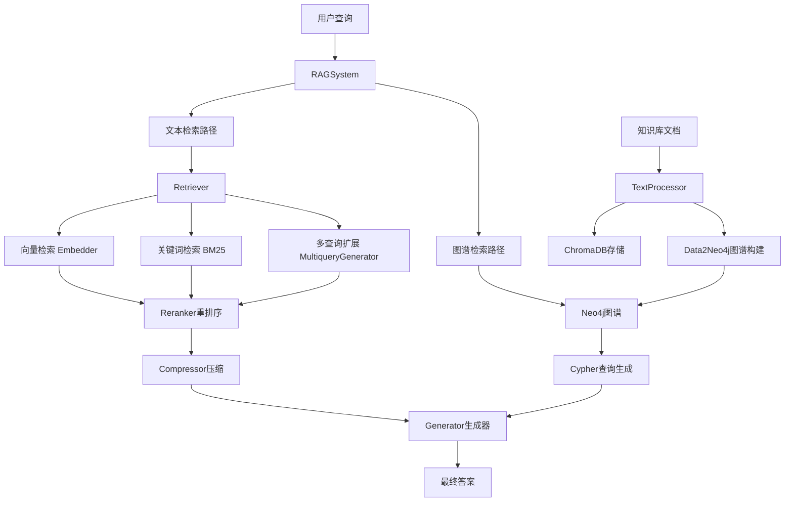
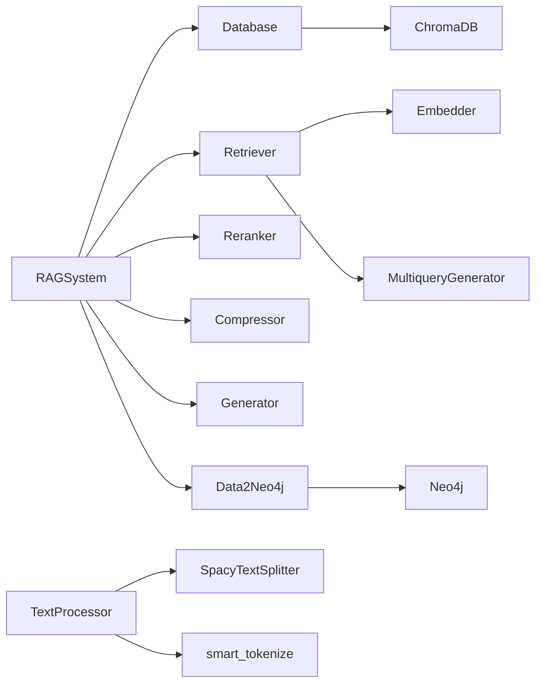

# RAG_demo 团队开发者文档 🚀

## 🆕 v2.0 架构重构说明 (2025-10-11)

**重要**: 本项目已完成模块化重构，目录结构有重大变化！

### 主要变更
- 📁 **目录重组**: `rag_system/neo/` → `rag_system/graph/`
- 🏗️ **模块分层**: 新增 `core/`, `text/`, `generation/`, `utils/` 分层
- 🔧 **导入路径**: 所有导入已更新为新路径
- 📝 **详细说明**: 见 `REFACTORING_CHANGELOG.md` 和 `HANDOVER_DOCUMENT.md`

### 快速迁移指南
```python
# ❌ 旧的导入方式
from rag_system.config import RAGConfig
from rag_system.neo.Data2Neo4j import Data2Neo4j

# ✅ 新的导入方式
from rag_system.core.config import RAGConfig
from rag_system.graph.Data2Neo4j import Data2Neo4j
```

---

## 📋 项目概览

这是一个基于检索增强生成（RAG）技术的智能问答系统，集成了**文本检索**和**知识图谱**两种数据源，支持多种检索策略和多语言处理。项目采用**模块化分层架构**设计，易于扩展和测试。

### 🎯 核心特性
- **多模式检索**: 文本检索（向量+关键词+混合） + 知识图谱检索
- **嵌入和回答双路由**：嵌入采用gemini api，问答和llm处理采用DeepSeek api
- **多语言支持**: 中英文智能分词和处理
- **智能重排序**: Cross-Encoder模型优化结果相关性
- **上下文压缩**: 减少token消耗，提升生成质量
- **查询扩展**: LLM生成多查询提升召回率
- **持久化存储**: ChromaDB + Neo4j双数据库架构

## 项目启动方式：

- 根目录下运行```python main.py```

## 🏗️ 系统架构

### 整体架构图


### 模块依赖关系


## 📁 项目结构详解

```
RAG_demo/
├── Knowledgebase/              # 📚 知识库文档目录
│   ├── Alan Turing.md         # 示例文档
│   ├── biology_knowledge.md   
│   └── ...
├── rag_system/                 # 🔧 核心系统模块
│   ├── config.py              # ⚙️ 配置管理
│   ├── rag_system.py          # 🎯 主系统类（入口点）
│   ├── database.py            # 💾 ChromaDB数据库管理
│   ├── retriever.py           # 🔍 检索器（文本检索核心）
│   ├── reranker.py            # 📊 重排序器
│   ├── compressor.py          # 🗜️ 上下文压缩器
│   ├── generator.py           # 🤖 答案生成器
│   ├── embedder.py            # 🧠 向量嵌入器
│   ├── multiquery_generator.py # 🔄 多查询生成器
│   ├── query_expander.py      # 📈 查询扩展抽象接口
│   ├── text_utils.py          # 📝 文本处理工具
│   ├── smart_tokenize.py      # ✂️ 智能分词器
│   └── neo/                   # 🕸️ 知识图谱模块
│       ├── Data2Neo4j.py      # 图谱构建与查询
│       └── data_structure.py  # 图谱数据结构定义
├── main.py                     # 🚀 主程序入口
├── requirements.txt            # 📦 依赖列表
└── README.md                   # 📖 项目文档
```

## 🔧 核心模块详解

### 1. RAGSystem (rag_system.py) - 系统主入口
**职责**: 系统总控制器，管理所有子模块的初始化和协调

**关键方法**:
- `add_corpus()`: 添加文档到知识库
- `remove_corpus()`: 删除文档
- `query()`: 统一查询接口，支持多种检索模式

**检索模式**:
- `vector`: 纯向量检索
- `keyword`: 纯关键词检索（BM25）
- `text_hybrid`: 文本混合检索（向量+BM25+RRF融合）
- `expand`: 多查询扩展检索
- `graph`: 纯图谱检索
- `hybrid`: **默认模式**，文本+图谱混合检索

### 2. Retriever (retriever.py) - 文本检索核心
**职责**: 实现多种文本检索策略和结果融合

**核心算法**:
- **RRF (Reciprocal Rank Fusion)**: `reciprocal_rank_fusion()` 
  - 融合多个检索结果列表
  - 公式: `score = Σ(1/(rank + k))`, k=60为平滑参数

**关键组件**:
- 依赖注入 `QueryExpander` 接口实现查询扩展
- 支持source_filter按文档过滤检索结果

### 3. Data2Neo4j (neo/Data2Neo4j.py) - 图谱构建与查询
**职责**: 文本到知识图谱的转换，以及图谱查询

**三步流水线架构**:
1. **粗提取**: `_extract_raw_triples()` - 提取(主体,关系,客体)三元组
2. **结构化**: `_structure_and_disambiguate_graph()` - 转换为JSON格式并消歧
3. **入库**: `_graph2neo4j()` - 写入Neo4j数据库

**查询流程**:
1. **Schema检索**: `_retrieve_relevant_schema()` - 根据问题检索相关节点/关系
2. **Cypher生成**: 基于Schema生成查询语句
3. **执行查询**: 返回结构化结果

**后处理优化**:
- `after_processing()`: 实体合并，解决重复节点问题
- `_llm_get_merge_mapping()`: 使用Function Calling识别重复实体
- `_execute_merge_operations()`: 使用APOC插件安全合并节点

### 4. TextProcessor (text_utils.py) - 文本处理
**职责**: 文件读取和文本分块

**支持格式**: .txt, .md, .docx
**分块策略**: 
- 使用 `SpacyTextSplitter` 基于语言模型分块
- 默认 chunk_size=256, overlap=25

### 5. Database (database.py) - 数据库管理
**职责**: ChromaDB和BM25索引管理

**核心功能**:
- `rebuild_bm25()`: 重建BM25索引
- 集成 `smart_tokenize` 进行中英文智能分词

## 🚨 当前技术难点与改进方向

### 🔴 优先级1: 分块粒度与图谱提取粒度不一致问题

**现状问题**:
- **文本分块**: 使用SpacyTextSplitter，chunk_size=256字符
- **图谱提取**: 按单个chunk提取知识图谱
- **粒度冲突**: 中英文句子长度差异导致chunk包含信息量不一致
- **代码执行**：写了chunk_size=256，但实际提取的时候还是会提取出远超256的文本块，导致图谱提取的粒度非常粗糙

**具体表现**:

```python
# text_utils.py 当前实现
def split_text(corpus: str, language="English", chunk_size=256, overlap=25):
    if language == "English":
        pipeline = "en_core_web_sm"  # 英文分词
    elif language == "Chinese":
        pipeline = "zh_core_web_sm"   # 中文分词
    else:
        raise ValueError("未知语言")
    splitter = SpacyTextSplitter(pipeline=pipeline, chunk_size=chunk_size, chunk_overlap=overlap)
    return splitter.split_text(corpus)
```

**问题分析**:

1. **语言差异**: 中文信息密度更高，256字符中文 vs 英文包含不同信息量
2. **提取质量**: chunk太小→图谱质量可以保证，但是我目前的三步流水线耗时太长，而且不同chunk之间无法沟通，可能引发相同实体反复建节点，为后续消歧增加工作量。chunk太大→实体关系混乱，llm提取信息粒度太过于粗糙，损失很多信息。
3. **查询对齐**: 检索时的chunk粒度与图谱构建粒度不匹配，查询质量不高。

**可能的改进方案**:（请仔细审查，这个只是一个初学者提出来的，我不知道靠不靠谱，我觉得不太靠谱，因为这个并没有解决建图的根本问题和冲突）

```python
# 建议的自适应分块策略
CHUNK_CONFIGS = {
    "Chinese": {
        "chunk_size": 200,      # 中文信息密度高，适当减小
        "overlap": 30,
        "min_chunk_size": 50,   # 最小chunk确保图谱质量
    },
    "English": {
        "chunk_size": 320,      # 英文可以适当增大
        "overlap": 40,
        "min_chunk_size": 80,
    }
}
```

### 🔵 优先级2: 图谱构建与查询粒度对齐（核心问题）

**核心问题**:
> 当前构建图谱的方式和查询图谱的方式，粒度对不齐，查询虽然指令遵循可以，但是建的图谱质量太差了

**问题根源分析**:

1. **构建粒度问题**:
   ```python
   # 当前Data2Neo4j.process()是按chunk构建
   def process(self, filename: str, text: str):
       # text是单个chunk，信息可能不完整
       raw_triples_str = self._extract_raw_triples(text)
   ```

2. **查询粒度问题**:
   ```python
   # 查询时期望完整的实体关系网络
   def query_graph_raw(self, question: str):
       # 但图谱是碎片化构建的，缺乏全局连贯性
   ```

**改进策略**:

**A. 分层图谱构建，但是逻辑会很复杂，需要经过和我的讨论**:

```python
class LayeredGraphBuilder:
    def build_document_level_graph(self, filename: str, full_text: str):
        """文档级图谱：全局实体识别"""
        pass
    
    def build_chunk_level_graph(self, chunk: str, doc_entities: List[str]):
        """chunk级图谱：基于已识别实体提取关系"""
        pass
    
    def merge_hierarchical_graphs(self):
        """合并层次化图谱"""
        pass
```

**B. 实体ID规范化，这个可能需要在图谱建立的时候让llm去维护**:

```python
# 建立实体别名映射表
ENTITY_ALIASES = {
    "图灵": ["艾伦·图灵", "Alan Turing", "A.M.Turing"],
    "计算机": ["电子计算机", "数字计算机", "computer"]
}
```

**C. 关系标签白名单，这个方案不太可行，毕竟需要手动维护，而且我们也没办法想到所有场景**:

```python
# 限制关系类型，提高图谱一致性
ALLOWED_RELATIONS = [
    "出生于", "死于", "工作于", "发明", "提出", 
    "参与", "影响", "师从", "合作", "创建"
]
```

### 🟡 优先级3: 异步并发优化

**现状问题**:

- 当前所有LLM调用都是同步的
- 批量文档处理时效率低下
- 图谱构建耗时过长

**涉及模块**:

1. **Data2Neo4j**: 图谱提取的三步流水线可并发
2. **Embedder**: 向量嵌入批处理可优化

**改进建议**:

```python
# 示例：异步多查询生成
async def expand_async(self, query: str, num_queries=3) -> List[str]:
    tasks = []
    for i in range(num_queries):
        task = asyncio.create_task(self._generate_single_query(query, i))
        tasks.append(task)
    results = await asyncio.gather(*tasks)
    return results
```

### 🟠 优先级4: 查询扩展提示词优化

**现在的提示词** (multiquery_generator.py):

```python
cypher_generation_prompt = f"""
        你是一名高效的 Neo4j Cypher 查询专家。你的任务是严格根据下面提供的“可用工具”和用户问题，生成一段 Cypher 代码。
        1.  使用 `id` 属性进行匹配。
        2.  查询和return语句中，保持变量名一致（是的，这么简单的错误也有可能犯）；
        3.  节点标签和关系类型**只能**来自列表里面提供的元素，绝对不要自己编造列表里不存在的词语
        4.  灵活查询：
            标签 / 关系批量匹配：用 标签1|标签2 或 关系1|关系2 或多个| 覆盖多类标签 / 关系，如匹配 Person|Organization 标签节点、查询 published|wrote 关系；
            批量固定匹配：用 IN ['id1', 'id2', 'id3'] 一次性匹配多个已知 id 的节点，如同时查询 “图灵”“布莱切利庄园”；
            前缀 / 后缀匹配：用 STARTS WITH '前缀' 或 ENDS WITH '后缀' 精准匹配 id 开头 / 结尾的内容，如匹配 id 以 “英” 开头的节点。
            模糊匹配：用 =~ '.*关键词.*' 匹配 id 含指定关键词的节点；
        
        ### 与问题相关的 Schema 和实体:
        {context_for_prompt}
        ---
        **用户问题**: {question}
        ---
        直接输出cypher查询，不要输出多余的内容。
        """
```

- 我个人感觉这个提示词已经写的很好了，无需改动，或者你可以根据“查询的广泛程度”排个序，改这一段提示词之前一定要和我先讨论。或者是引入邻居查询，邻居的邻居的查询之类的。

**可能的改进方案，大体意思** (基于项目规范memory):

```python
1. **同义改写**: 使用不同表达方式重述原问题
2. **实体别名**: 考虑实体的不同称呼或翻译
3. **术语扩展**: 扩展专业术语和相关概念
4. **子主题分解**: 将复合问题分解为子方面
5. **属性机制**: 从不同属性角度提问
```

但是这些方案一定不要让模型自己去编造节点关系和边的类型，或者引入不存在的标签，这个问题我改的很头疼，不要再犯了。我目前用的模型是DeepSeek-chat，这个模型能力还是可以的。

### 🟣 优先级5: 快速测试与回归机制

**问题**: 
> 建一个图谱时间太长了，难以测试，导致最终图谱查询的质量也不高

**解决方案**:

**A. 小样本快速测试，可以采用**:

```python
class QuickTester:
    def __init__(self):
        self.test_docs = [
            "图灵_简介.md",  # 50行以内的测试文档
            "AI_基础.md"
        ]
    
    def quick_graph_test(self):
        """5分钟内完成图谱构建+查询测试"""
        for doc in self.test_docs:
            # 构建小图谱
            # 执行标准查询集
            # 评估质量指标
            pass
```

**B. 图谱质量评估指标，这个东西在后续开发中考虑，当前是先实现稳定的查询**:

```python
def evaluate_graph_quality(self, test_queries: List[str]) -> Dict[str, float]:
    return {
        "entity_coverage": 0.0,    # 实体覆盖率
        "relation_accuracy": 0.0,  # 关系准确性
        "query_success_rate": 0.0, # 查询成功率
        "response_relevance": 0.0  # 答案相关性
    }
```

**C. 增量测试机制，同样也是后续优化点**:

```python
def incremental_test(self):
    """增量添加文档，观察图谱质量变化"""
    quality_trends = []
    for i, doc in enumerate(self.test_docs):
        self.add_corpus(doc)
        quality = self.evaluate_graph_quality(self.standard_queries)
        quality_trends.append((i, quality))
    return quality_trends
```

### 🟣 优先级6: 后处理逻辑修改

- 当前后处理，依然面临着实体太多、边太多导致的llm淹没在信息中的问题，可能消歧操作并不会生效
- 可能会采用类似于查询时的三步走策略，但是我们需要首先在查询步骤中验证可行性。

### 🟣 优先级7: 考虑引入多模态

- 前期项目准备完善后，考虑引入多模态，如图片对应的图片解析模型，图片的嵌入和图谱的构建，以及pdf解析器、latex公式解析、表格解析等等，比如说可以引入minerU工具。

### 🟣 优先级8: 系统整体优化

- 当前这个项目更多是属于原型演示，小demo，想做成真正可用的的话需要有一个简单的前端UI，然后需要性能上的优化，打造一个个人或者企业真正能用的东西。

## 🔍 关键配置参数

### 文本处理配置
```python
# text_utils.py
CHUNK_SIZE = 256        # 当前固定值，需要改为语言自适应
CHUNK_OVERLAP = 25      # 重叠大小

# smart_tokenize.py  
MIN_TOKEN_LENGTH = 1    # 最小token长度，影响BM25效果
```

### 图谱构建配置
```python
# Data2Neo4j.py
BATCH_SIZE = 100           # 文档块批处理大小，这个是硬性规定
TEMPERATURE = 0.0          # LLM温度，影响提取稳定性
MAX_ENTITIES_PER_CHUNK = 10 # 每个chunk最大实体数（建议新增）
```

### 检索配置  
```python
# retriever.py
RRF_K = 60              # RRF平滑参数
DEFAULT_K = 10          # 默认检索数量
DEFAULT_TOP_N = 4       # 重排序后保留数量
```

## 🐛 已知Issue与Workaround

### Issue 1: 中文单字符干扰BM25
**位置**: `smart_tokenize.py`
**问题**: 中文分词产生单字符影响BM25准确性
**临时方案**: 使用`len(token.strip()) >= 1`过滤，但仍需优化

### Issue 2: Gemini API批量限制
**位置**: `rag_system.py - add_corpus()`
**问题**: 超过100个文档块时API报错
**解决方案**: 已实现batch_size=100分批处理

## 📚 开发规范

### 代码风格
- 使用类型注解: `def query(self, query: str, k: int = 10) -> str`
- 错误处理: 关键路径必须有try-catch

### 测试规范
- 每个新功能需要对应的测试用例
- 图谱构建功能需要小样本快速测试
- API调用需要模拟测试避免消耗额度

### 文档更新
- 新增配置参数需要更新config.py注释
- 核心算法变更需要更新README.md
- 重大架构调整需要更新本文档

---

**最后更新**: 2025-10-07  
**文档版本**: v1.0  
**维护者**: RAG开发团队


# 后续优化方向（现在立刻马上的）

1.加上可以指定不同的知识库
2.依然是分块粒度太粗了，提取质量也不高
3.所有需要实体的地方可以安排一个排序
4.**属性不够丰富！！！信息不够多**
5.消歧没发挥作用
6.超长上下文，多处
7.raise self._make_status_error_from_response(err.response) from None  
openai.BadRequestError: Error code: 400 - {'error': {'message': "This model's maximum context length is 131072 tokens. Howe  
ver, you requested 156082 tokens (156082 in the messages, 0 in the completion). Please reduce the length of the messages or completion.", 'type': 'invalid_request_error', 'param': None, 'code': 'invalid_request_error'}}


项目截止到现在，的问答示例：

```
（待填充）
```

